# Hybrid Groups

*Hybrid Groups* is a multi-user, multi-agent platform where users and agents form groups to collaborate on a common goal. Interactions with agents go beyond basic `user` and `assistant` roles and include the identity of group members. Agents in a group are aware of all other group members, and their [behavior also depends on the sender's identity](#group-communication).

The *Hybrid Groups* project provides:

- A Python library for building hybrid group applications
- A platform for building and running group-aware agents
- Integrations with 3rd party platforms like Slack or GitHub

> [!NOTE]
> This project is under early, active development.

## Overview

| Visual | Description |
|---|---|
| <a href="docs/images/overview-1.png?raw=true" target="_blank">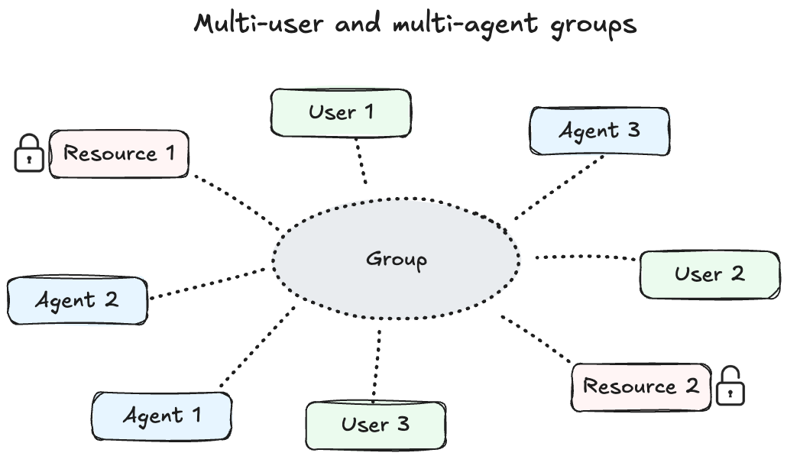</a> | **Multi-user and multi-agent groups:** A group connects multiple users and agents, allowing them to collaborate on a common goal and access private and shared resources.|
| <a href="docs/images/overview-2.png?raw=true" target="_blank">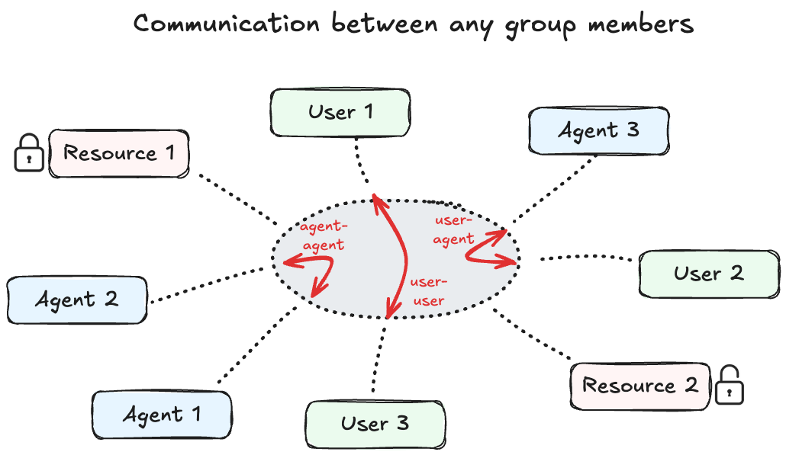</a> | **Communication between any group members:** A group enables communication between users, between agents and between users and agents. Any agent in a group is aware of the identity and interactions of all other group members. |
| <a href="docs/images/overview-6.png?raw=true" target="_blank">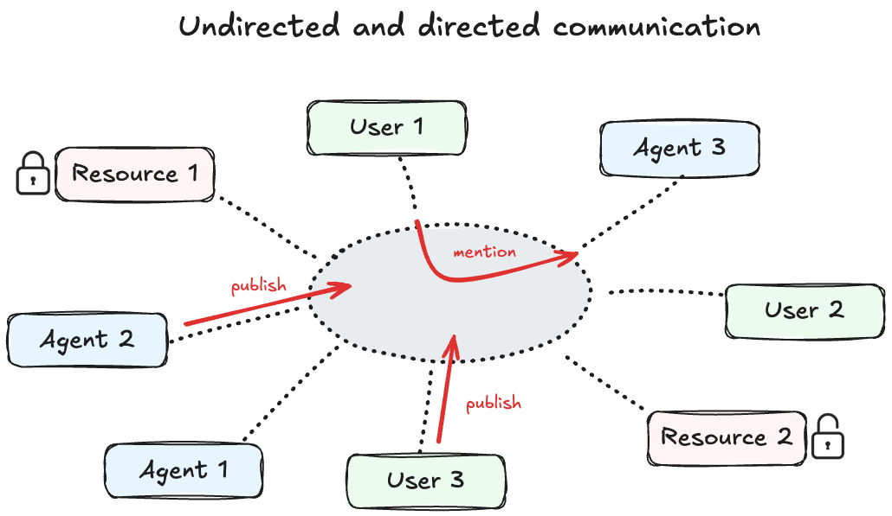</a> | **Undirected and directed communication:** A group supports both undirected communication through publishing messages and targeted communication by mentioning specific users or agents. |
| <a href="docs/images/overview-3.png?raw=true" target="_blank">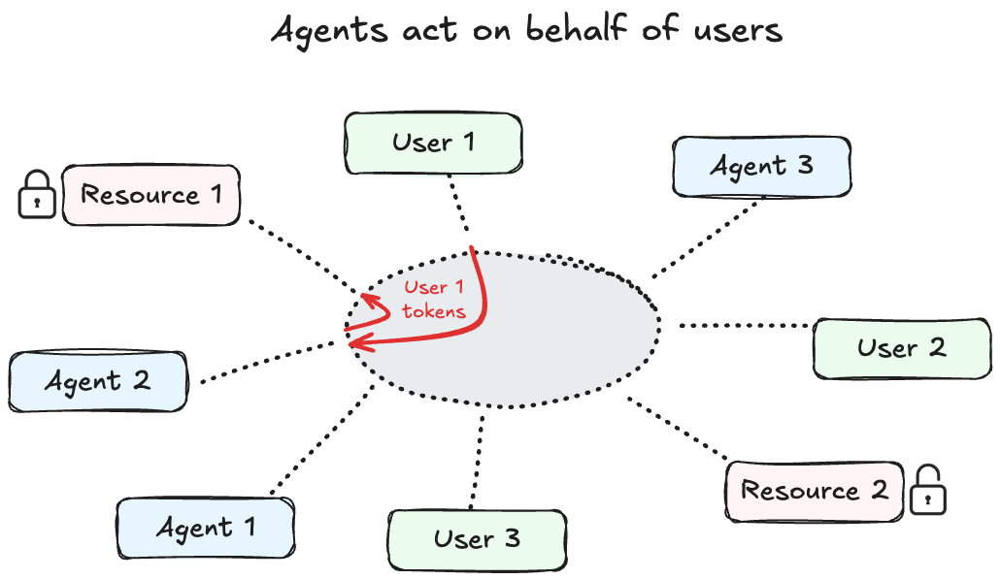</a> | **Agents act on behalf of users:** User-agent interactions propagate user-specific tokens to agents so that they can access protected resources on behalf of the user. This also works along agent handoff chains.|
| <a href="docs/images/overview-4.png?raw=true" target="_blank">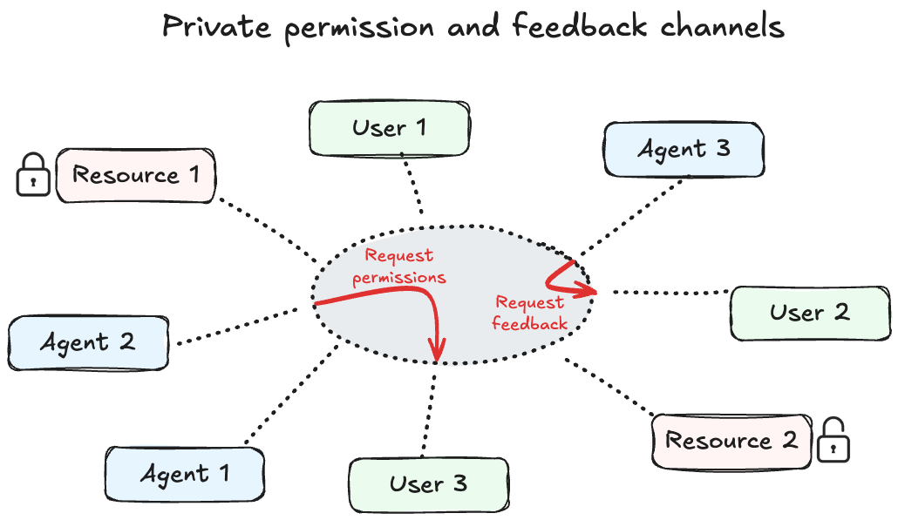</a> | **Private permission and feedback channels:** Agents may ask initiating users for permissions to execute actions or solicit feedback in case of ambiguities. This is done via private user channels that are separated from the shared group communication channel. |
| <a href="docs/images/overview-5.png?raw=true" target="_blank">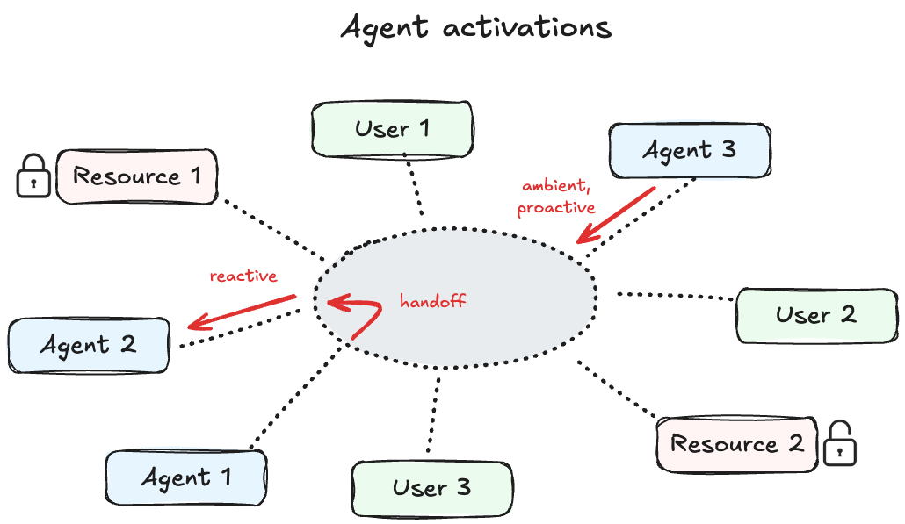</a> | **Agent activations:** Agents can be activated in different ways: reactively based on user requests, via handoffs from other agents, or behave proactively based on trigger events. |
| <a href="docs/images/overview-7.png?raw=true" target="_blank">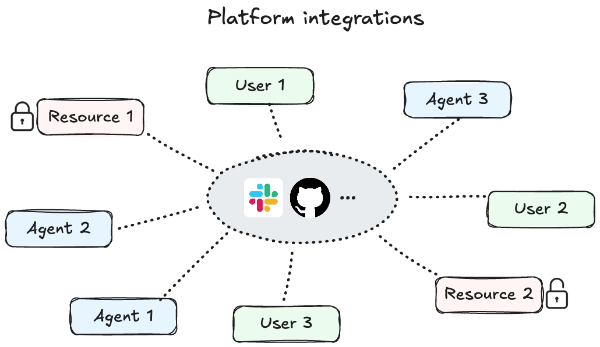</a> | **Platform integrations:** *Hybrid Groups* integrates with 3rd party platforms like Slack or GitHub. It also provides its own platform, with terminal user interfaces for experimentation and demonstration purposes.|

## Project setup

See [DEVELOPMENT.md](DEVELOPMENT.md) for project setup instructions.

## Getting started

The following example application runs the project's demo platform with a simplified setup:

- Permissions to execute agent tools are granted by default, without asking users for permission
- Any username is accepted by the application for login, authentication at a user registry is skipped
- API tokens for MCP servers are set globally in a `.env` file, user-specific tokens are not used

This simplified setup is helpful for quickly experimenting with multi-user, multi-agent group conversations on a single machine, using one terminal window per user.

For more advanced setups, see sections [private user channels](#private-user-channels), [user registration](#user-registration) and [user token propagation](#user-token-propagation). Running hybrid groups in Slack or on GitHub is described in section [platform integrations](#platform-integrations).

### Application setup

1. Use the [examples/register_agents.py](examples/register_agents.py) script to register agents `browser`, `search`, `scrape` and `weather` at the application's agent registry. They are kept deliberately simple for demonstration purposes.

```shell
python examples/register_agents.py
```

2. Create a `.env` file with the following API keys:

```env
OPENAI_API_KEY=...
BRAVE_API_KEY=...
FIRECRAWL_API_KEY=... # optional
```

- An `OPENAI_API_KEY` is required for the `openai:gpt-4.1` model configured for all agents.
- A `BRAVE_API_KEY` is required for the [Brave Search MCP server](https://github.com/modelcontextprotocol/servers-archived/tree/main/src/brave-search) of the `search` agent.
- A `FIRECRAWL_API_KEY` is required for the [Firecrawl MCP server](https://github.com/mendableai/firecrawl-mcp-server) of the `scrape` agent. Optional, not used in the examples below.

### Start application server

Run the [examples/app_server.py](examples/app_server.py) script to start the example application server:

```shell
python examples/app_server.py --gateway terminal
```

The `--gateway` option defines the group communication platform to use. Supported values are `terminal`, `slack` and `github`. The `terminal` gateway runs the default platform provided by the project for experimentation and demonstration purposes. For multi-user, multi-agent group conversations in Slack or on GitHub, see section [platform integrations](#platform-integrations).

In contrast to `slack` and `github`, the `terminal` gateway only manages a single group session per application server run. Use the `--session-id` option to resume a group session from a previous run, or to define the ID of a new session.
A `slack` gateway manages a separate group session per Slack thread and the `github` gateway manages a separate group session per GitHub issue or pull request.


The `app_server.py` script defines an additional `gradion` agent. Its main task is handoff to more specialized agents in the agent registry. If you are not sure which agent to use from the registry, mention `@gradion` in a group conversation and it will either handoff to an appropriate specialist agent or try to respond to queries itself.

### Start terminal clients

Open three (POSIX) terminal windows and run the [examples/app_client.py](examples/app_client.py) script with a distinct username in each terminal:

```shell
python examples/app_client.py --username chris --password ""
python examples/app_client.py --username erich --password ""
python examples/app_client.py --username martin --password ""
```

You should see something like:

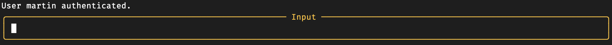

### Group communication

Below is a group communication example between users `chris`, `erich` and `martin`, and agents `gradion`, `search` and `weather`. The terminal window of `martin` is shown.

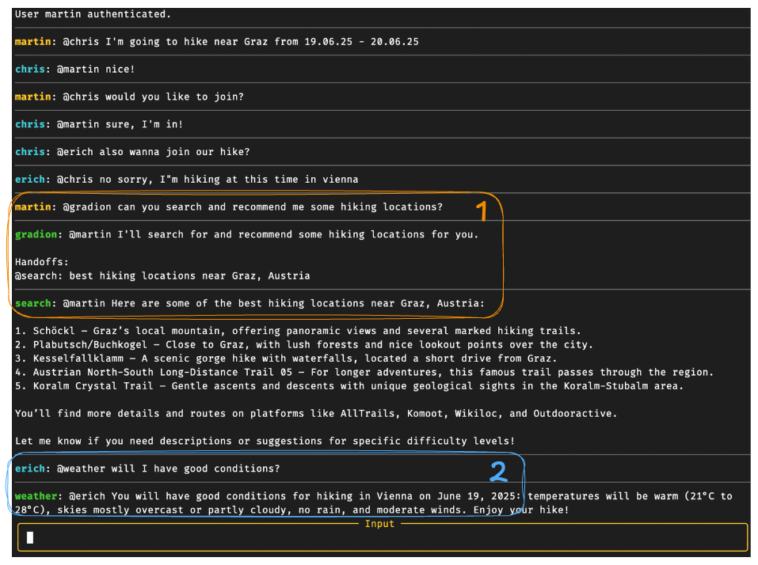

The initial communication between the three users is about hiking areas near two cities, Graz and Vienna. The subsequent user-agent interactions demonstrate how agents provide answers not only based on user message content but also on user identity.

1. When `martin` asks `gradion` about hiking locations, the agent must also use `martin`'s identity to understand that relevant hiking locations for `martin` are those near Graz, since he is planning a trip there. The `gradion` agent delegates web search to the `search` agent which also propagates the user's identity via handoff.
2. When `erich` asks `weather` about conditions, the agent uses `erich`'s identity to infer Vienna as relevant location, since `erich` is hiking there.

### Private user channels

Starting the example application server with the `--user-channel` option enables running private user channels from separate terminal windows for granting action permissions and answering feedback requests.

```shell
python examples/app_server.py --gateway terminal --user-channel
```

Start a chat client and a user channel for user `martin` in separate terminal windows:

```shell
python examples/app_client.py --username martin --password ""
python examples/user_channel.py --username martin --password ""
```

The conversation example below between `martin` and agents sends one permission request and one feedback request to `martin`'s user channel.

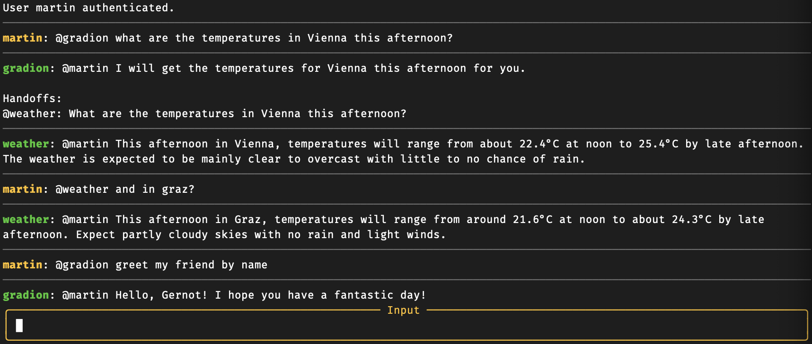

The permission to execute the `get_weather_forecast` tool is granted by `martin` for the duration of the session. Hence, a second request to the `weather` agent is answered without sending a permission request. An instruction to the `gradion` agent to greet `martin`'s friend by name, which the agent cannot know, causes it to request `martin`'s feedback through the user channel.

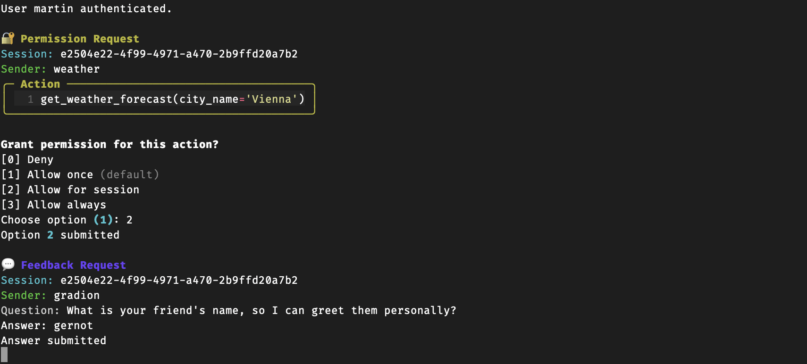

### User registration

Running MCP servers with a user's private API tokens requires user registration. The [examples/register_user.py](examples/register_user.py) script allows interactive registration of users. The registration process prompts for:

- Username and password
- Environment variables to be stored as user secrets (encrypted tokens)
- Slack member ID and GitHub username for mapping them to the registered username

After user registration and running the example application server with the `--user-registry` option,

```shell
python examples/app_server.py --gateway terminal --user-channel --user-registry
```

users are now required login with the correct username and password, otherwise, authentication will fail. Omitting the `--password` option for the clients will prompt for a password:

```shell
python examples/app_client.py --username martin
python examples/user_channel.py --username martin
```

### User token propagation

With the `--user-registry` option set, the application server now uses the stored secrets of registered users as user-specific API tokens for MCP servers.

### Platform integrations

#### Slack

The Slack integration enables multi-user, multi-agent conversations in Slack threads. Each thread creates a separate group session that persists across application server restarts.

The Slack integration works through a dedicated [Slack app](https://api.slack.com/docs/apps) that creates an *app agent* which can be used directly or that delegates to other agents in the agent registry.

Set up the Slack app by following the [Slack integration guide](docs/slack-integration-guide.md). The name that is assigned to the Slack app becomes the name of the Slack *app agent*. Once installed in a Slack workspace, users can interact with the *app agent* and other registered agents in Slack threads.

> [!NOTE]
> For the following, we assume an *app agent* named `Gradion Agent`.

To start a conversation, add the *app agent* to any channel and mention it with a query as shown it the example below. This creates a new Slack thread (= new group session) where the *app agent* and all registered agents become available as group members. Within a thread, users can interact with agents in two ways:

* mention the *app agent* (e.g. `@Gradion Agent`) for general queries or handoffs to specialized agents, or
* directly mention any registered agent by it's name as defined in the agent registry (e.g. `@weather`).

In agent responses, the agent name is shown next to a bot icon. The following example shows the *app agent* handling a weather query, handing off to a `weather` agent:

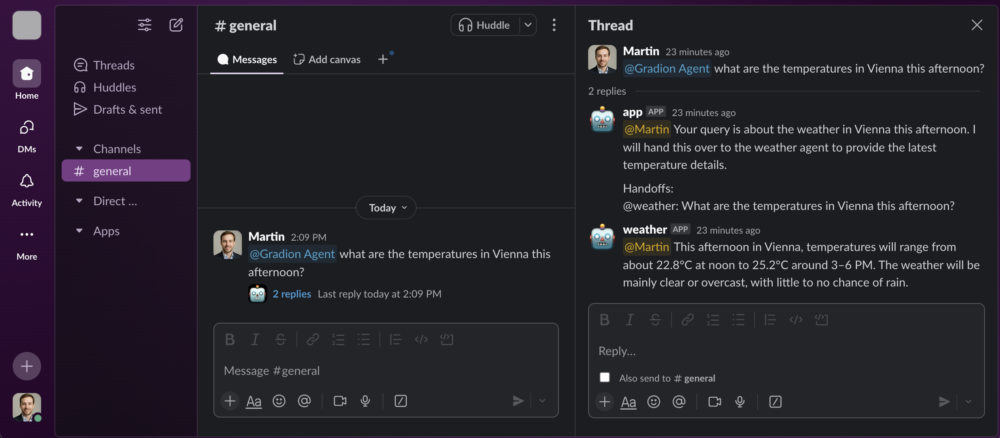

##### Usage

To run the example application server with the simplified setup described in [getting started](#getting-started) using the `slack` gateway, run:

```shell
python examples/app_server.py --gateway slack
```

To enable [private user channels](#private-user-channels) and use private API tokens, follow the steps in the section [user registration](#user-registration), provide your Slack member ID during registration and run the following commands:

```shell
# start server
python examples/app_server.py --gateway slack --user-channel --user-registry

# in another terminal
python examples/user_channel.py --username {REGISTERED_USERNAME}
```

> [!TIP]
> To find your Slack member ID, open your user profile in the Slack desktop or web app, click the three dots (More options), and select "Copy Member ID".

#### GitHub

The GitHub integration enables multi-user, multi-agent conversations within GitHub issues and pull requests. Each issue or pull request creates its own group session that persists across server restarts.

The GitHub integration works through a dedicated [GitHub App](https://docs.github.com/en/apps/creating-github-apps/about-creating-github-apps/about-creating-github-apps) that creates an *app agent* which can be used directly or that delegates to other agents in the agent registry.

Set up the GitHub App by following the [GitHub integration guide](docs/github-integration-guide.md). The name that is assigned to the GitHub App becomes the name of the GitHub *app agent*. Once installed in a repository, users can interact with the *app agent* and other registered agents in issues and pull requests.

> [!NOTE]
> For the following, we assume an *app agent* named `gradion-agent`.

To start a conversation, mention the *app agent* or any other registered agent in an issue or pull request from a repository where the app is installed. This creates a new group session. The GitHub integration supports two interaction patterns:

* mention the *app agent* (e.g. `@gradion-agent`) for general queries or handoffs to specialized agents, or
* directly mention any registered agent using the format `@app-agent-name/agent-name`, where `agent-name` is the name of the agent in the agent registry (e.g. `@gradion-agent/weather`).

Agent responses are labeled with the agent's name in brackets (e.g. `[weather]` in the example below). The following example demonstrates the *app agent* receiving a weather query and handing off to the `weather` agent:

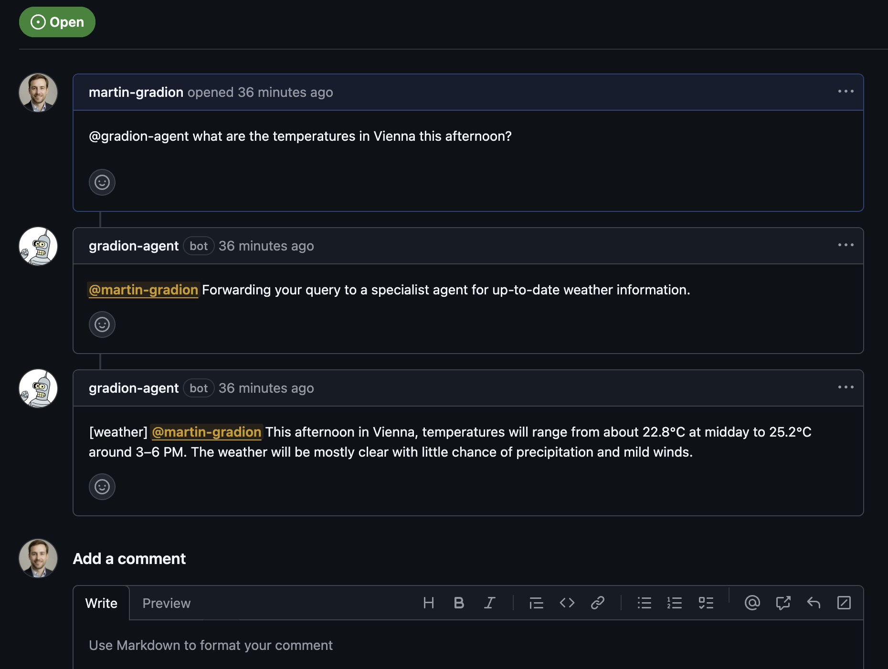

##### Usage

To enable the GitHub integration, ensure that webhook events from GitHub are forwarded to the local gateway.
The following example assumes usage of [smee.io](https://smee.io) during [setup](docs/github-integration-guide.md) and a locally running [smee-client](https://www.npmjs.com/package/smee-client).

```
smee -u https://smee.io/{CHANNEL_ID} -t http://127.0.0.1:8000/api/v1/github-webhook
```

To run the application server using the `github` gateway with the simplified setup described in [getting started](#getting-started) run:

```shell
python examples/app_server.py --gateway github
```

To enable [private user channels](#private-user-channels) and use private API tokens, follow the steps in the section [user registration](#user-registration), provide your GitHub username during registration and run the following commands:

```shell
# start server
python examples/app_server.py --gateway github --user-channel --user-registry

# in another terminal
python examples/user_channel.py --username {REGISTERED_USERNAME}
```

## Library usage

The following resources are examples how to use the `hygroup` package as library for building hybrid group applications. An official user guide is coming soon.

- [examples/app_server.py](examples/app_server.py) - Example application server
- [examples/app_client.py](examples/app_client.py) - Example group chat client with terminal interface
- [examples/user_channel.py](examples/user_channel.py) - Private user channel with terminal interface
- [examples/register_agents.py](examples/register_agents.py) - Registration of example agents
- [examples/register_user.py](examples/register_user.py) - Interactive registration of users
