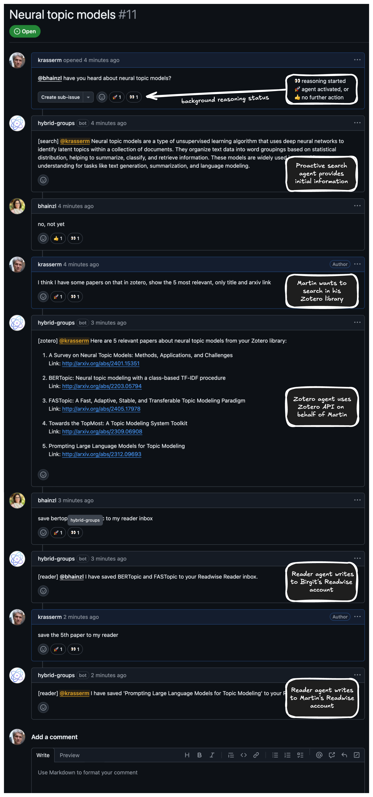

# Hybrid Groups

*Hybrid Groups* is a multi-user, multi-agent platform that enables teams to collaborate with proactive and reactive agents in Slack and GitHub. It adds background reasoning to Slack threads and GitHub issues to intelligently activate agents based on chat messages and context. Agents reason, act and respond specific to a user's identity, preferences and history, and can take actions on behalf of a user. In Slack, users can build custom agents with a simple agent builder. More advanced agents or agentic systems can be integrated with the *Hybrid Groups* Python SDK.

> [!NOTE]
> Find out more in the [user guide](https://gradion-ai.github.io/hybrid-groups/).

