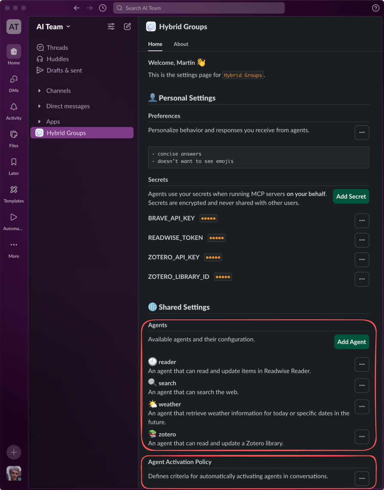
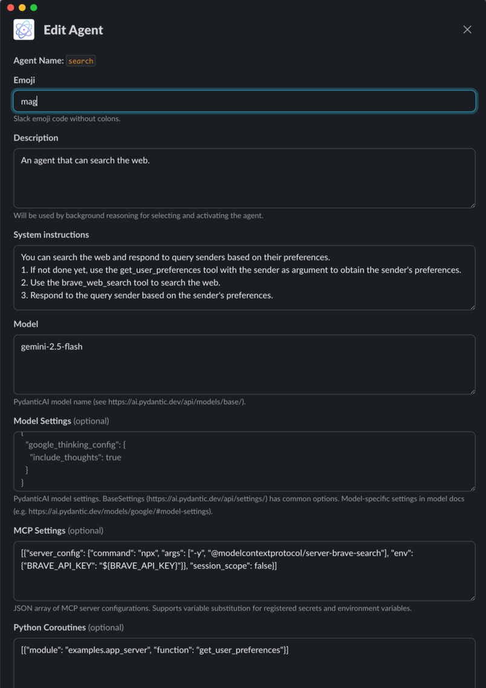

## Agent builder

The *Hybrid Groups* Slack app includes a simple agent builder, which consists of the agent-related sections in the app's home view. From there, you can open the agent editor by clicking the `Add Agent` button or by selecting `Edit` from an agent's menu. In the editor, users can build custom agents by defining their system prompt, model and tools. An agent's description and the agent activation policy ([example](selector.md)) determine if an agent is activated by background reasoning. For integrating more advanced agents or agentic systems, use the *Hybrid Groups* Python SDK.

<table align="center">
<tr>
<td valign="top" align="center">
<a href="images/features/feature-9a.png?raw=true" target="_blank"></a><br>
Agent configuration sections in the <i>Hybrid Groups</i> Slack app home view.
</td>
<td valign="top" align="center">
<a href="images/features/feature-9b.png?raw=true" target="_blank"></a><br>
Editor for configuring the system prompt, model and tools of an agent.
</td>
</tr>
</table>

### Model

The model is specified as a [PydanticAI model name](https://ai.pydantic.dev/api/models/base/).

```json
"gemini-2.5-flash"
```
### Model Settings

Model settings can be [common model settings](https://ai.pydantic.dev/api/settings/) or specific to a given provider. The following example shows a setting for [Google Gemini](https://ai.pydantic.dev/models/google/#model-settings).

```json
{
  "google_thinking_config": {
    "thinking_budget": 2048
  }
}
```

### MCP settings

MCP settings are defined as a JSON array of MCP server configurations. In `env` or `headers`, you can use placeholders for values (e.g. `${VAR_NAME}`). These will be substituted at runtime with user secrets or environment variables.

```json
[
  {
    "server_config": {
      "command": "npx",
      "args": [
        "-y",
        "@modelcontextprotocol/server-brave-search"
      ],
      "env": {
        "BRAVE_API_KEY": "${BRAVE_API_KEY}"
      }
    },
    "session_scope": false
  }
]
```

The `session_scope` setting determines the lifecycle of an MCP server and how placeholders are substituted:

- `session_scope: true`: The server is started once per session and reused across requests (session scope). This is the recommended and most performant option. It supports substituting placeholders with environment variables.
- `session_scope: false`: A new server is started for each agent request (request scope). This may be less performant but is **required** if you need to substitute placeholders with user secrets. It also supports substituting placeholders with environment variables.

### Python coroutines

You can configure `async` Python functions as tools for an agent by specifying their `module` and `function` name.

```json
[
  {
    "module": "examples.weather",
    "function": "get_weather_forecast"
  }
]
``` 
