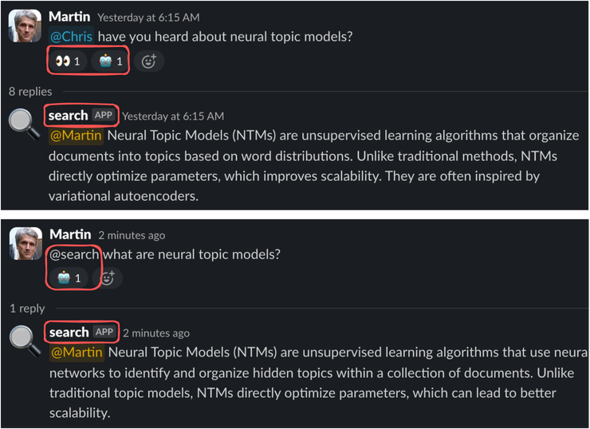
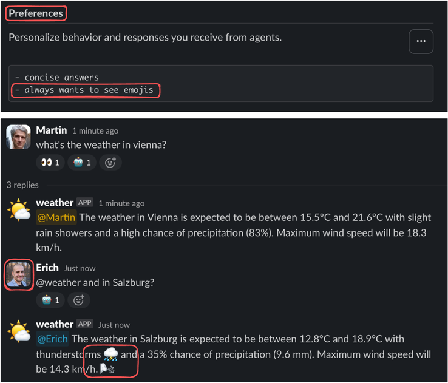
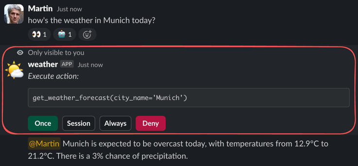
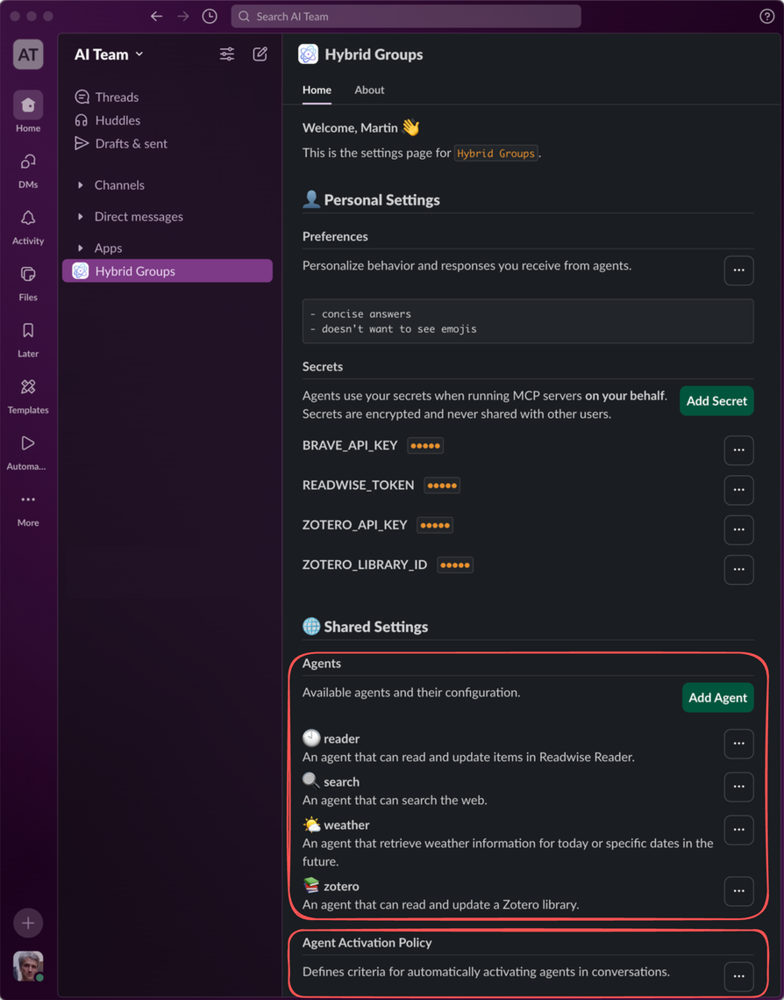

## Features

- **Background reasoning** Background reasoning scans new user messages and decides whether to activate an appropriate agent or not. Background reasoning status is indicated by reactions on user messages: :eyes: reasoning started, :robot_face: agent activated and :ballot_box_with_check: no further action. Background reasoning and agent activation are guided by an [agent activation policy](selector.md), agent descriptions and user messages and their context. The agent activation policy and agent descriptions are configurable. 

- **Proactive agents**. Proactive agents are agents that are activated by background reasoning. If a user message expresses an information need or a desired action, an appropriate agent is activated, if available in the agent registry.
- **Reactive agents**. Reactive agents are agents that are activated by user messages that start with a direct mention of these agents. Direct mentions bypass background reasoning, resulting in lower response latencies.
- **Group awareness**. An agent is aware of all other members in a group session and their activities. There is no need to include group context into queries. A group session in *Hybrid Groups* corresponds to a [thread](https://slack.com/help/articles/115000769927-Use-threads-to-organize-discussions) in Slack or an [issue](https://docs.github.com/en/issues/tracking-your-work-with-issues/about-issues) in GitHub. Each session runs their own instances of agents and background reasoners to isolate them from other sessions. For including context from other sessions, *Hybrid Groups* supports session references, e.g. issue references in a GitHub issue.
- **User preferences**. User preferences allow personalization of agent behavior and response styles. The same agent instance in a group session can respect the preferences of different users, responding to each in a personalized way.
- **User secrets**. User secrets (API_KEYS, ...) are private user data in *Hybrid Groups* and enable agents to perform actions on a user's behalf. They configure MCP servers with user secrets at runtime to enable access to private resources. User secrets are encrypted at rest and never shared with other users. Support of OAuth 2.0 is planned.
- **Tool permissions**. Users can allow or deny agents the execution of tools. Execution permissions can be granted once, for the duration of a group session or permanently. They are user-specific and are requested from users through private channels. For example, permission requests in Slack are sent via [ephemeral messages](https://api.slack.com/surfaces/messages#ephemeral) that are only visible to the user who triggered the execution. *Hybrid groups* also supports sending permission requests though other private channels, like a terminal-based remote interface, for example.
- **Agent handoffs**. Agents can be configured to handoff tasks to other, more specialized agents. They search the agent registry for appropriate agents and handoff the task to them. They may also decide to work on the task themselves if they have the required skills or no appropriate agent is available a handoff. User context is preserved in a handoff, or even in a chain of handoffs. For example, in a handoff chain `User -> Agent A -> Agent B -> Agent C`, `Agent C` still acts on behalf of the user.
- **Agent builder** ...

| Visual | Description |
|---|---|
|  | **Feature 1:** Feature 1 description.|
|  | **Feature 2a:** Feature 2 description.|
|  | **Feature 2b:** Feature 3 description.|
|  | **Feature 3:** Feature 4 description.|
|  | **Feature 4:** Feature 5 description.|
|  | **Feature 5:** Feature 6 description.|
|  | **Feature 6:** Feature 7 description.|
|  | **Feature 7:** Feature 8 description.|

### Agent builder

<table>
<tr>
<td valign="top"></td>
<td valign="top"></td>
</tr>
</table>

### Extra

By using variables for `env` or `headers` values in an agent's MCP server, they can be substituted by user secrets at runtime. Substitution with user secrets is supported for MCP servers in request scope (`session_scope: false`). These servers are 
