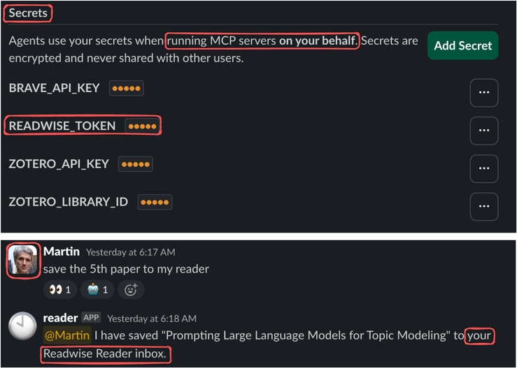

## Features

- background reasoning
- proactive agents
- reactive agents
- group awareness
- user preferences
- user secrets
- tool permissions
- agent handoffs
- agent builder

| Visual | Description |
|---|---|
|  | **Feature 1:** Feature 1 description.|
|  | **Feature 2a:** Feature 2a description.|
|  | **Feature 2b:** Feature 2b description.|
|  | **Feature 3:** Feature 3 description.|
|  | **Feature 4:** Feature 4 description.|
|  | **Feature 5:** Feature 5 description.|
|  | **Feature 6:** Feature 6 description.|
|  | **Feature 7:** Feature 7 description.|

### Agent builder

<table>
<tr>
<td valign="top"></td>
<td valign="top"></td>
</tr>
</table>
