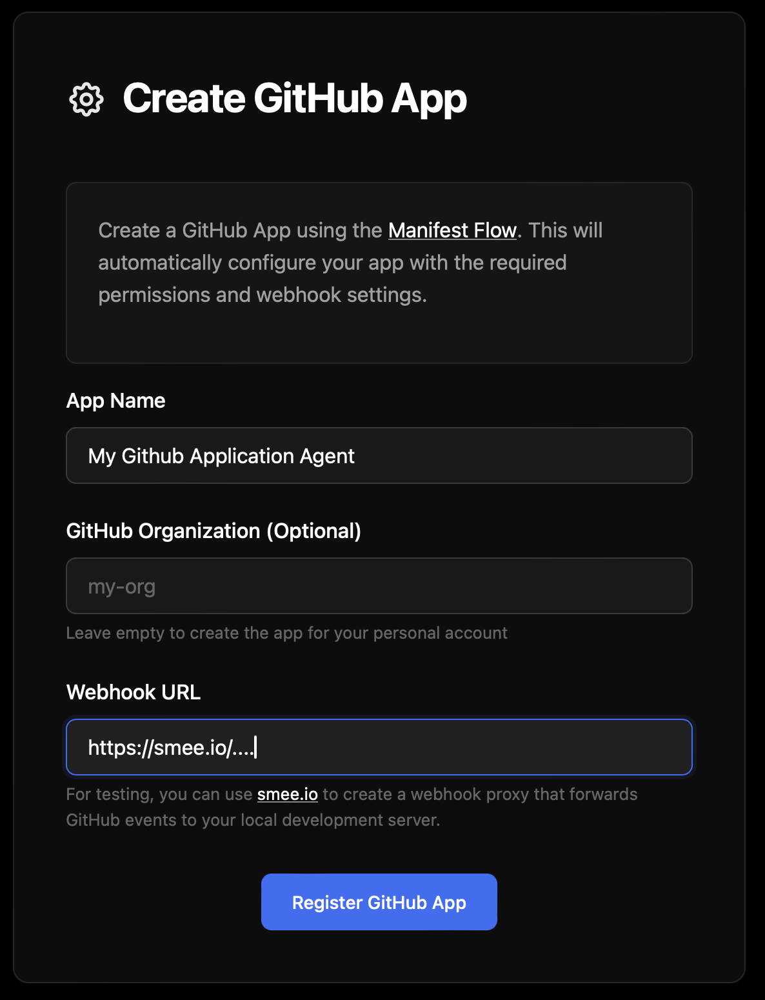
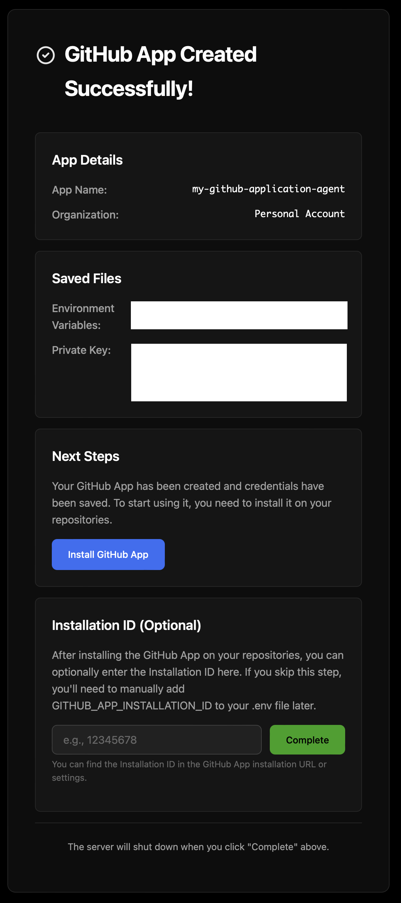
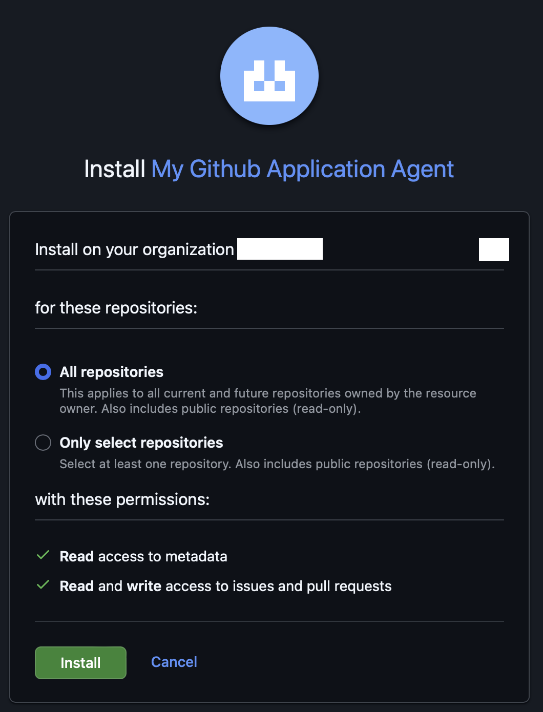
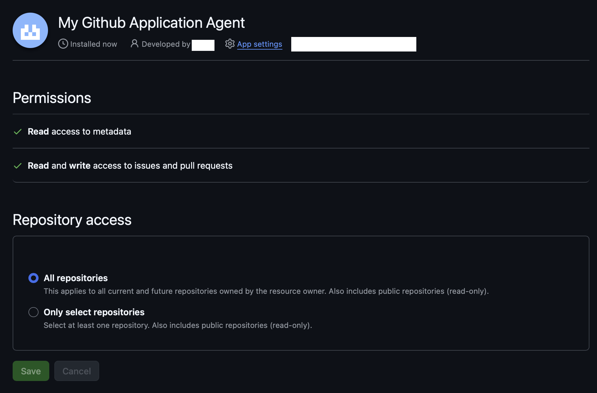

# Set up the GitHub Integration

This guide will show you how to integrate Hybrid Groups with GitHub using the [GitHub App Manifest Flow](https://docs.github.com/en/apps/sharing-github-apps/registering-a-github-app-from-a-manifest). 

## Prerequisites

- **GitHub account** (personal or organization)
- **GitHub repository** to install the GitHub App

## Create the GitHub App

### 1. Start the setup script

```bash
python -m hygroup.setup.apps github
```

A browser opens to the GitHub App setup page.

### 2. Configure your app's settings

- **App Name**: A Unique identifier (e.g., "My GitHub Application Agent"). Becomes `@my-github-application-agent` when mentioning the GitHub App in issues and PRs.
- **Organization**: Your GitHub organization name or leave blank for personal account. 
- **Webhook URL**: Where GitHub sends events. Use [smee.io](https://smee.io/) for local testing.



### 3. Register the app on GitHub

Click `Register GitHub App` to be navigated to GitHub's app creation page, where you can review the name and confirm by clicking `Create GitHub App for [your account/org]`.


After successful completion you are redirected back to the setup page.



## Install the GitHub App to your repositories

### 1. Begin installation

Click `Install GitHub App` on the setup page and choose where to install it.


### 2. Confirm permissions

Select the repositories and review the required permissions, then click `Install`.



### 3. Installation completed

On successful installation you are redirected to the GitHub app installations page.



Copy the installation ID from the URL of this page.


### 4. Complete installation setup

Return to the setup page, enter the installation ID and click `Complete`.

## Generated Credentials

Upon successful completion of the setup, credentials are automatically saved in your `.env` file and the GitHub App private key is stored in `.secrets/github-apps/{app-name}.pem`.

### Environment variables

| Variable | Purpose |
| --- | --- |
| `GITHUB_APP_ID` | App identifier |
| `GITHUB_APP_USERNAME` | App agent name - use this to interact with the GitHub App in issues and PRs |
| `GITHUB_APP_CLIENT_SECRET` | OAuth authentication secret |
| `GITHUB_APP_WEBHOOK_SECRET` | Webhook verification secret  |
| `GITHUB_APP_PRIVATE_KEY_PATH` | Location of private key used for API authentication |
| `GITHUB_APP_INSTALLATION_ID` | Unique ID of the GitHub installation |
