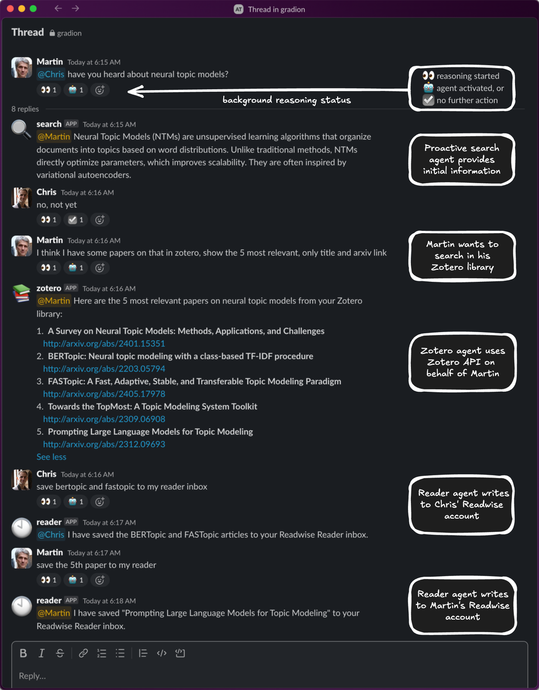
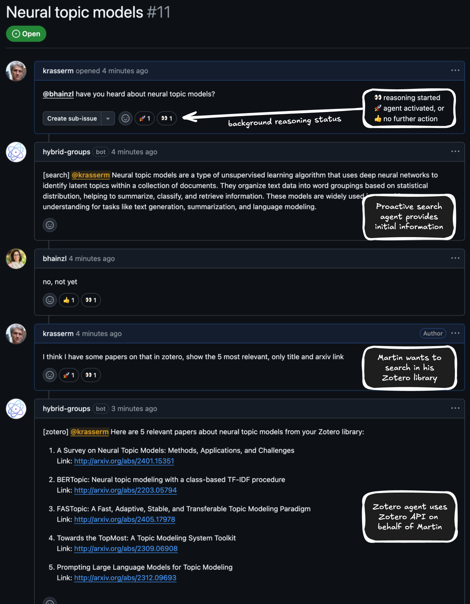
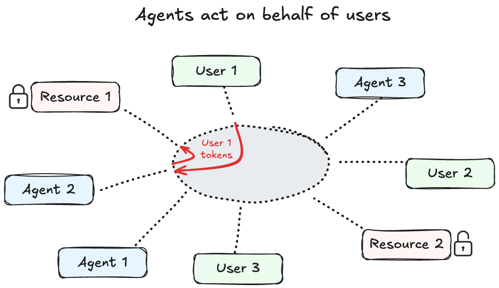

# Introduction

*Hybrid Groups* integrates [Group Genie](https://gradion-ai.github.io/group-genie/) into Slack and GitHub. It enables existing single-user AI agents to participate in group chat conversations without requiring modification to the agents themselves. While many AI agents excel at responding to direct queries from individual users, they typically cannot handle multi-party conversations where relevant information emerges from complex exchanges between multiple participants. *Hybrid Groups* solves this by combining intelligent pattern detection with a flexible agent integration layer. It monitors group chats, detects conversation patterns, and reformulates multi-party exchanges into self-contained queries that AI agents can process.

    <iframe src="https://www.youtube.com/embed/OxOmRsNin4o" frameborder="0" allowfullscreen style="position: absolute; top: 0; left: 0; width: 100%; height: 100%;"></iframe>

*Hybrid Groups* supports user-specific credentials and preferences, session persistence for resuming conversations after restarts, service connectors for accessing 250+ external services (Gmail, Notion, Figma, etc.), media attachment support, action approval workflows, and custom commands. Agents act on behalf of individual team members using their personal credentials and preferences, enabling users to securely access their private resources while maintaining proper access boundaries to other users. 

!!! Tip "Tutorial"

    Check the [tutorial](tutorial.md) for a feature overview with examples.

  

    

      
      
    

    
<b>Figure 1:</b> A <i>Hybrid Groups</i> thread in Slack.

  

  

    

      
      
    

    
<b>Figure 2:</b> A <i>Hybrid Groups</i> thread in GitHub.

  

