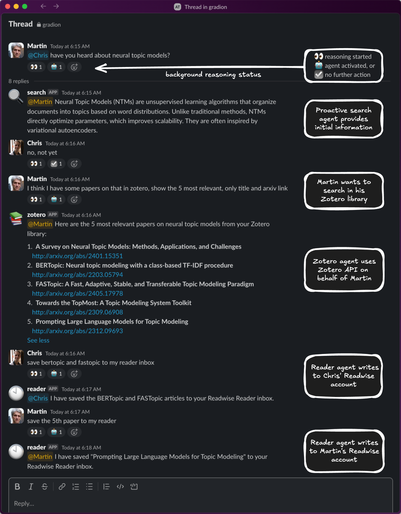
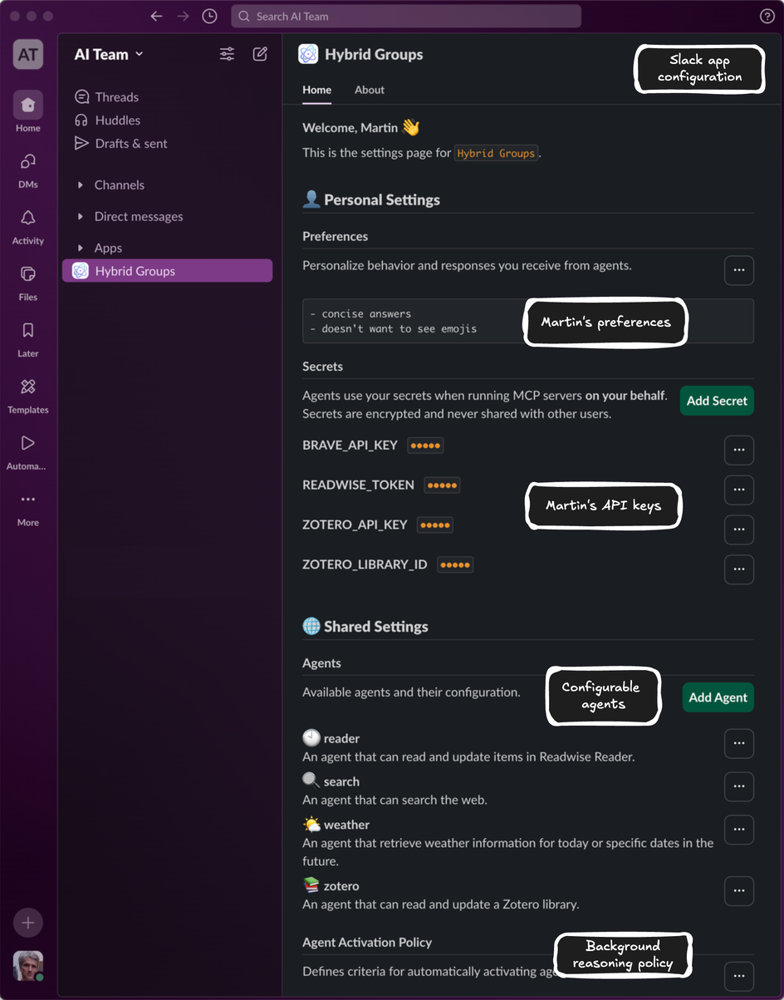
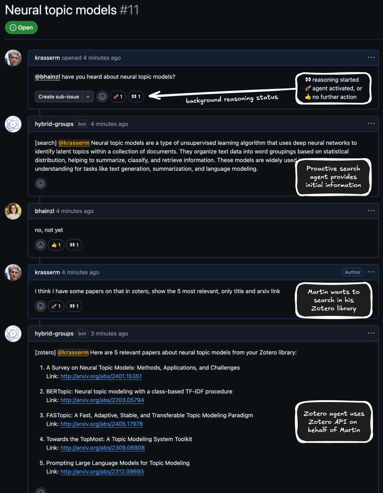

## Introduction

*Hybrid Groups* is a multi-user, multi-agent platform that enables teams to collaborate with proactive and reactive agents in Slack and GitHub. 
It adds background reasoning to Slack threads and GitHub issues to intelligently activate agents based on chat messages and context. 
Agents reason, act and respond specific to a user's identity, preferences and history, and can take actions on behalf of a user.
Users can build custom agents with an *agent builder* or integrate more advanced agents or agentic systems with the *Python SDK*.

<table>
<tr>
<td valign="top" align="center">
 
A <i>Hybrid Groups</i> thread in Slack.
</td>
<td valign="top" align="center">
 
The <i>Hybrid Groups</i> Slack app home view.
</td>
<td valign="top" align="center">
 
A <i>Hybrid Groups</i> thread in GitHub.
</td>
</tr>
</table>
