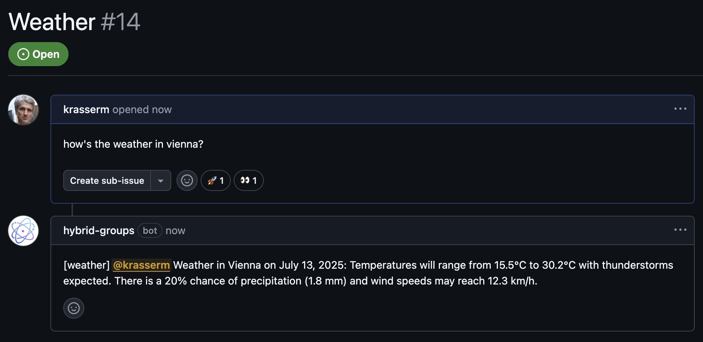

# Quickstart

!!! Tip "Docker"

    *Hybrid Groups* provides a Docker container to run the Slack and GitHub apps without a local installation.      

    1. Setup the app (prints the setup URL to follow in the output) - **only required once per app**:
    ```bash    
    docker run --rm -it \
      -v "$(pwd)/.data-docker":/app/.data \
      -p 8801:8801 \
      ghcr.io/gradion-ai/hybrid-groups:latest \
      setup <slack | github>            
    ```
    **Important**: when running the container on a remote host, supply the hostname or IP address via the `--host` parameter.
    
    2. Run the server:
    ```bash
    docker run --rm -it \
      -v "$(pwd)/.data-docker":/app/.data \
      ghcr.io/gradion-ai/hybrid-groups:latest \
      server <slack | github>
    ```
    For Slack, add `--user-channel slack` to enable [user channels](./app-server/#slack).
    

## App installation

Follow the [installation](installation.md) instructions for setting up the development environment and installing the Slack and GitHub apps.

## Gemini API key

A [GEMINI_API_KEY](https://aistudio.google.com/apikey) is required for background reasoning and by demo agents. Place it in a `.env` file in the project's root directory.

```env title=".env"
GEMINI_API_KEY=...
```

## Agent registration

Register example agents by running the following command. Without any additional API keys, this will add agents `general` and `weather` to the agent registry.

```shell
python demo/register_agents.py
```

!!! Hint

    Other agents in the [demo/register_agents.py](https://github.com/gradion-ai/hybrid-groups/blob/main/demo/register_agents.py) script require additional API keys for running their MCP servers. These can be added to `.env` if sharing API keys among users is acceptable. For running MCP servers with user-specific API keys, users need to add them as user secrets in the Slack app's [home view](images/overview/overview-2.png) or via [user registration](user-registry.md).

## App server

To serve the Slack app, run:

```shell
python -m hygroup.scripts.server --gateway slack
```

To serve the GitHub app, run:

```shell
python -m hygroup.scripts.server --gateway github
```

The GitHub app server additionally requires a [smee.io](https://smee.io/) channel for webhook payload delivery. A channel is generated during the GitHub app setup and stored in the `.env` file as `GITHUB_APP_WEBHOOK_URL`. To connect to the channel, install the [smee client](https://github.com/probot/smee-client) and run:

```shell
source .env \
&& smee -u $GITHUB_APP_WEBHOOK_URL -t http://127.0.0.1:8000/api/v1/github-webhook
```

## Usage example

Activate the `weather` agent via background reasoning by entering e.g.

```markdown
how's the weather in vienna?
```

in the channel where the Slack app was added

<div class="image-zoom quickstart-image">
  <a href="../images/quickstart/quickstart-1.png" target="_blank"></a>
  <a href="../images/quickstart/quickstart-1.png" target="_blank" class="large-link"></a>
</div>

or in the description of a new GitHub issue:

<div class="image-zoom quickstart-image">
  <a href="../images/quickstart/quickstart-2.png" target="_blank"></a>
  <a href="../images/quickstart/quickstart-2.png" target="_blank" class="large-link"></a>
</div>

For directly mentioning the `weather` agent in Slack, use `@weather` at the beginning of a message, in GitHub use `@hybrid-groups/weather` (and replace `hybrid-groups` with the GitHub app name you've chosen).
