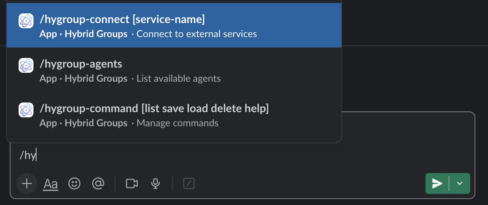
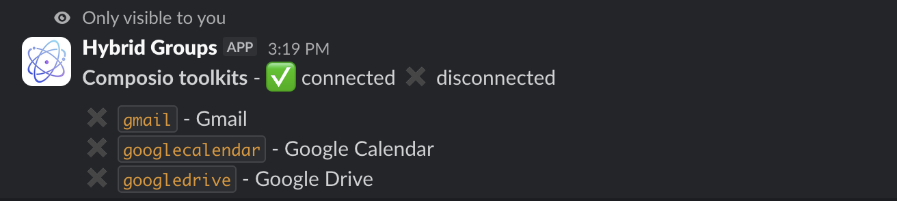
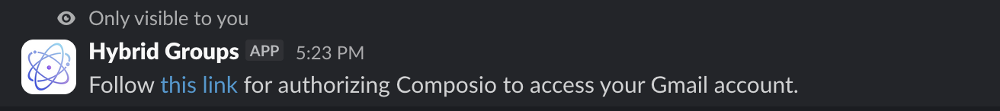
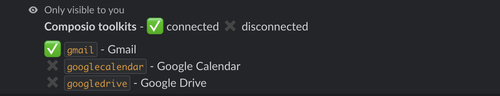

# Service connectors

*Hybrid Groups* connects to popular services like Gmail, Notion, Figma, etc. through [Composio](https://composio.dev/), which provides access to 250+ services called [toolkits](https://docs.composio.dev/toolkits/introduction). Users authorize access to their service accounts via OAuth or API keys. *Hybrid Groups* agents use [Composio MCP servers](https://docs.composio.dev/docs/mcp-overview) to access these services on behalf of individual users.

## Composio API key

Creating MCP servers via the [Composio API](https://docs.composio.dev/api-reference/) requires a Composio [API key](https://app.composio.dev/developer). Create an account at Composio, get an API key from the [developer dashboard](https://app.composio.dev/developer) and add it to project's `.env` file:

```env title=".env"
COMPOSIO_API_KEY=...
```

## Setup MCP servers

Input for creating Composio MCP servers is a JSON file like the following `toolkits.json`file. Keys are Composio [toolkit](https://docs.composio.dev/toolkits/introduction) names (lowercase), values contain the `tools` that the corresponding MCP server should expose. 

```json title="toolkits.json"
{
    "gmail": {
        "display_name": "Gmail",
        "tools": [
            "GMAIL_FETCH_EMAILS",
            "GMAIL_GET_ATTACHMENT",
            "GMAIL_CREATE_EMAIL_DRAFT",
            "GMAIL_DELETE_DRAFT",
            "GMAIL_LIST_DRAFTS",
            "GMAIL_LIST_LABELS"
        ]
    },
    "googlecalendar": {
        "display_name": "Google Calendar",
        "tools": [
            "GOOGLECALENDAR_FIND_EVENT",
            "GOOGLECALENDAR_CREATE_EVENT"
        ]
    },
    "googledrive": {
        "display_name": "Google Drive",
        "tools": [
            "GOOGLEDRIVE_CREATE_FILE",
            "GOOGLEDRIVE_CREATE_FOLDER",
            "GOOGLEDRIVE_DOWNLOAD_FILE",
            "GOOGLEDRIVE_GET_REVISION",
            "GOOGLEDRIVE_LIST_FILES",
            "GOOGLEDRIVE_LIST_REVISIONS",
            "GOOGLEDRIVE_MOVE_FILE",
            "GOOGLEDRIVE_UPLOAD_FILE",
            "GOOGLEDRIVE_COPY_FILE",
            "GOOGLEDRIVE_CREATE_FILE_FROM_TEXT",
            "GOOGLEDRIVE_EDIT_FILE",
            "GOOGLEDRIVE_FIND_FILE",
            "GOOGLEDRIVE_FIND_FOLDER"
        ]
    }
}
```

!!! Tip
    To get a list of available tools for a given `<toolkit>`, run:
    
    ```shell
    python -m hygroup.scripts.composio tools <toolkit>
    ```

Create Composio MCP servers with:

```shell
python -m hygroup.scripts.composio setup --toolkit-config-path toolkits.json
```

You should now see a Composio configuration at `.data/composio/config.json`. When running the `/hygroup-connect` command in Slack



you should see the following output:



## Authorize access

Run the `/hygroup-connect <toolkit>` command in Slack to initiate the authorization flow for a service identified by `<toolkit>`. For example, running `/hygroup-connect gmail` returns a link to initiate the OAuth flow for Gmail:



Click on the link and follow the instructions on the OAuth consent screen to authorize access. After successful authorization, the `/hygroup-connect` command should show the `gmail` toolkit as :white_check_mark: connected:



!!! Failure "Access restrictions"

    An agent using the `gmail` toolkit's MCP server can now access your Gmail account when **you** interact with the agent. Other users do not have access to your Gmail account when interacting with the same agent. They can access their own Gmail accounts after they have authorized access. In other words, authorizing access to a user's service account is done **on a per-user basis**, and **not globally** for the application.
