# Tutorial

This tutorial demonstrates how to install, run and use the *Hybrid Groups* Slack app.

## Initial setup

### Python package

Create a minimal `hybrid-groups-quickstart` project and install the `hybrid-groups` package:

```bash
uv init --bare --python 3.11 hybrid-groups-quickstart
cd hybrid-groups-quickstart
uv add hybrid-groups
```

### Slack app

Launch the Slack app installation wizard and follow the instructions on the screen.

```bash
uv run python -m hygroup.setup.apps slack
```

After installation, you should see the following variables in a `.env` file:

```env title=".env"
SLACK_BOT_TOKEN=...
SLACK_BOT_ID=...
SLACK_APP_TOKEN=...
SLACK_APP_USER_ID=...
```

### API keys

Add a [Gemini API key](https://aistudio.google.com/apikey) and a [Brave Search API key](https://api-dashboard.search.brave.com/app/keys) to the `.env` file:

```env title=".env"
GEMINI_API_KEY=...  # required
BRAVE_API_KEY=...  # optional
```

Adding a `BRAVE_API_KEY` to `.env` enables all users to use this API key for web search in the quickstart example. Alternatively, users can add a `BRAVE_API_KEY` to their [personal settings](#personal-settings) in the Slack app's home view, so that they can search with their own API key.

### Slack channel

Go the the Slack workspace where you installed the app and create a channel. In the channel's menu, `Open channel details` -> `Integrations` -> `Add apps`, and select the `Hybrid Groups` app. 

## Agent registration

Add some predefined [example agents](https://github.com/gradion-ai/hybrid-groups/blob/main/hygroup/examples/agents.py) to the [agent registry](agent-registry.md) with:

```shell
uv run python -m hygroup.examples.agents
```

This creates an agent registry at `.data/agents/registry.json` with the following agents:

- A `system` agent that monitors all messages in a [group chat](#group-sessions). It may decide to stay silent or respond to a message, depending on message content, context and [system instructions](https://github.com/gradion-ai/hybrid-groups/blob/main/hygroup/agent/system/prompt.md). It is configured with a [Brave Search MCP server](https://github.com/brave/brave-search-mcp-server), a [weather forecast](https://github.com/gradion-ai/hybrid-groups/blob/main/hygroup/examples/weather.py) tool, and it can run all other agents in the registry as subagents.
- A `math` agent that can execute Python code for calculations, data analysis, and visualizations. It is configured with an [ipybox MCP server](https://gradion-ai.github.io/ipybox/mcp-server/) for secure code execution in a sandbox.
- An `office` agent that can manage a user's Gmail, Google Calendar, and Google Drive. It uses [service connectors](service-connectors.md) to access these services on behalf of individual users.

!!! Note
    For using the `office` agent, add an `OPENAI_API_KEY` to `.env` as the agent uses `openai:gpt-5-mini` as model.

    ```env title=".env"
    OPENAI_API_KEY=...
    ```

## Application server

Start the Slack [application server](application-server.md) with:

```shell
uv run python -m hygroup.scripts.server --gateway slack
```

## Verify registration

 In the created [Slack channel](#slack-channel), start typing `/hy` in the message box, select the `/hygroup-agents` slash command
 
 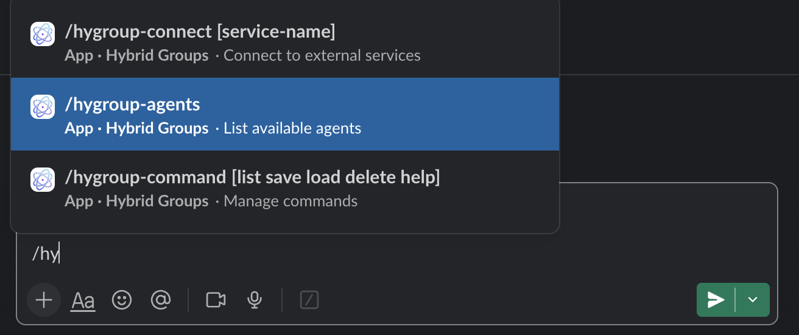
 
 and press `Enter` to see the list of registered example agents:

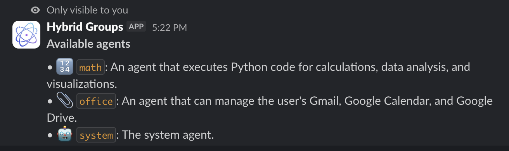

## Personal settings

Click on the `Hybrid Groups` app in Slack, then the `Home` tab to see your personal settings. It allows defining preferences, like agent response style, and also your secrets, like API keys. 

In the following example, the user provides his own `BRAVE_API_KEY` that is used by the Brave Search MCP server instead of the default `BRAVE_API_KEY` in the `.env` file.

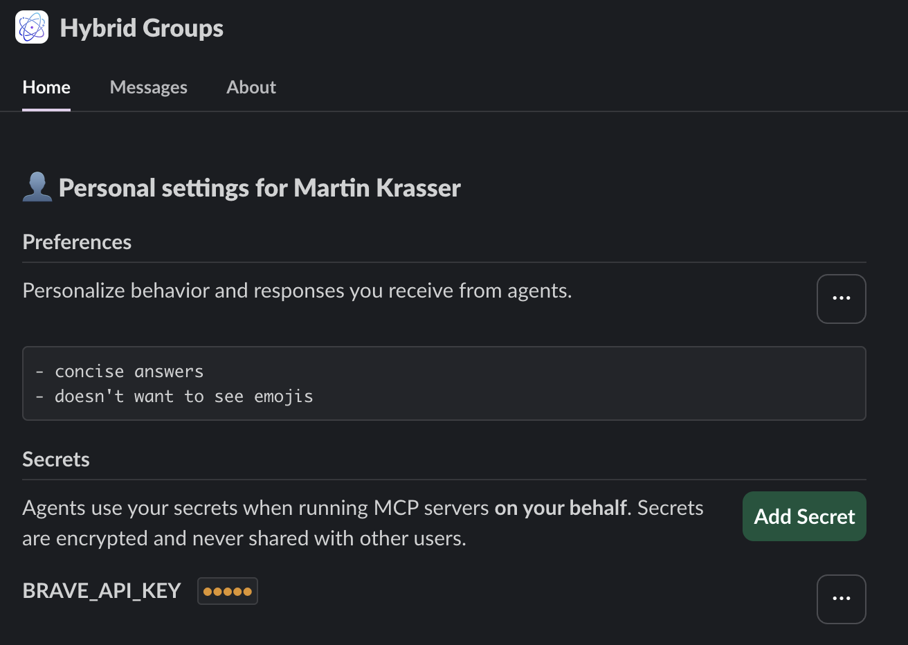

## Group sessions

Users and agents collaborate in group sessions, corresponding to a [thread](https://slack.com/help/articles/115000769927-Use-threads-to-organize-discussions) in Slack. Each thread runs its own instances of agents.
The system agent, displayed as `Hybrid Groups` app, monitors :eyes: all messages and decides whether to respond :robot: or stay silent :ballot_box_with_check:. 

!!! Note "Subagents"

    The system agent may also invoke other agents as subagents, like the `math` agent in the following example.

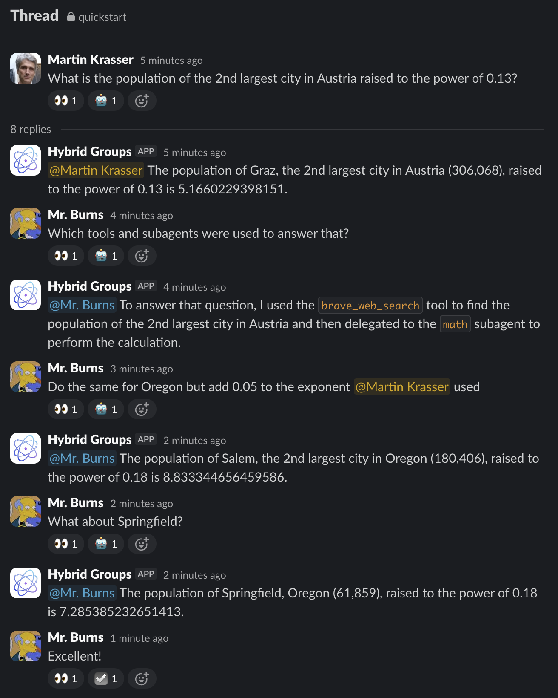

Users may also invoke an agent directly by mentioning it. For example, starting a message with `@math` invokes the `math` agent directly, bypassing the system agent.
Starting a message  with `@Hybrid Groups` invokes the system agent. When the system agent is mentioned explicitly, it always generates a response :robot:.

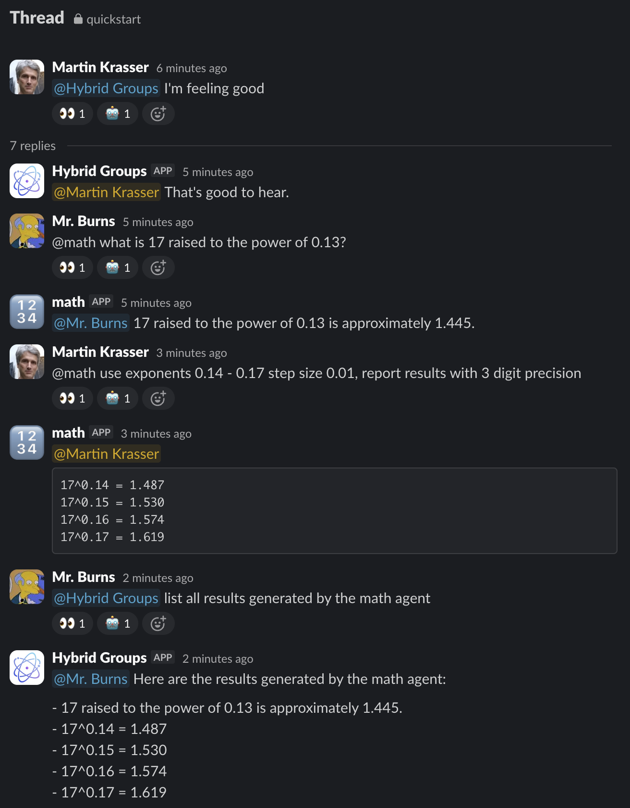

## Session persistence

    Session and agent state are persisted. Group session can be resumed after an [application server](application-server.md) restart.

## Service connectors

!!! Note

    *Hybrid Groups* uses [Composio](https://composio.dev/) to connect to 250+ services, like Gmail, Notion, Figma, etc. Follow [these setup instructions](service-connectors.md) for using service connectors. 

To enable the `office` agent to access Gmail on behalf of individual users, each user must authorize access to their Gmail account by running the `/hygroup-connect gmail` slash command in Slack. This must be done only once per user.


*Hybrid Groups* responds to this command with a link to initiate the OAuth flow for Gmail:


Click on the link and follow the instructions on the OAuth consent screen to authorize access. After successful authorization, the `/hygroup-connect` slash command should show the `gmail` toolkit as :white_check_mark: connected:


Users who have not authorized access should see the `gmail` toolkit as :heavy_multiplication_x: disconnected:


Users who have authorized access to their Gmail account can now use it in group sessions.

!!! Failure "Access restrictions"

    Users can only access their own Gmail account, never those of other users. Users **never** have access to service accounts of other users.

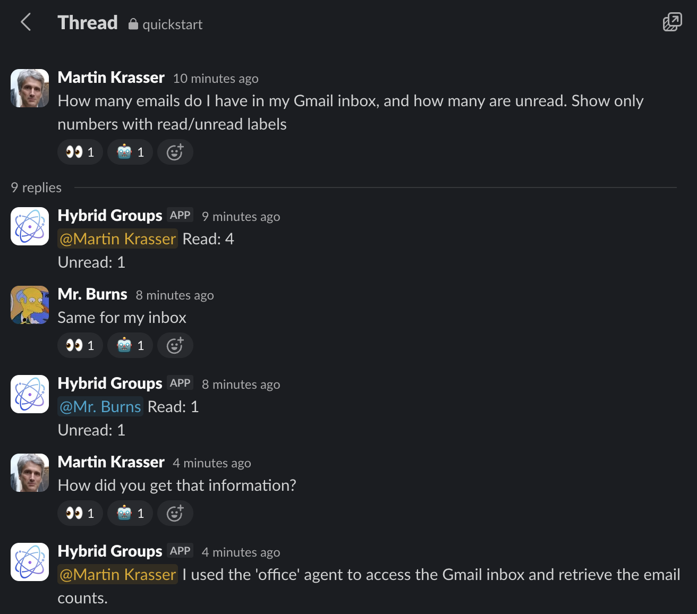

## Media attachments

Users can attach media files (images, videos, sound files, ...) and documents (PDFs, ...) to Slack messages for being processed by agents. They are also accessible to subagents.

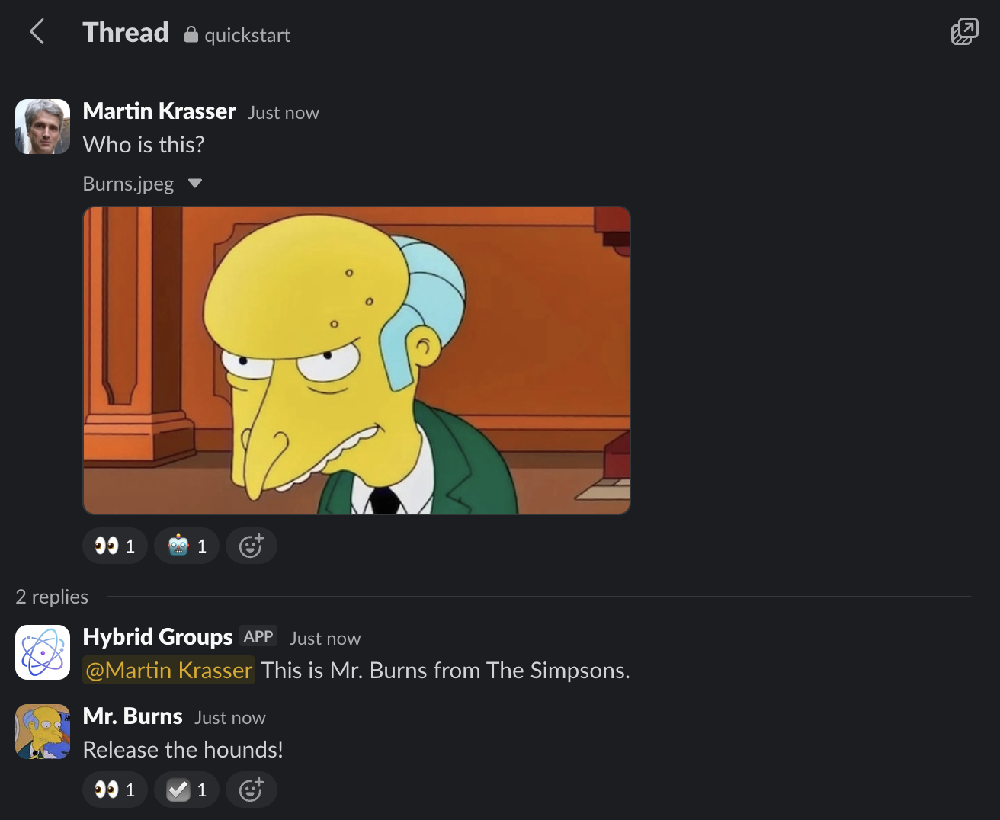

## Action approval

Users can be requested to approve actions executed on their behalf by starting the application server with the `--user-channel slack` option:

```shell
uv run python -m hygroup.scripts.server --gateway slack --user-channel slack
```

Approval requests are sent  to the initiating user as [ephemeral messages](https://docs.slack.dev/messaging/#ephemeral) i.e. messages that are only visible to that user.

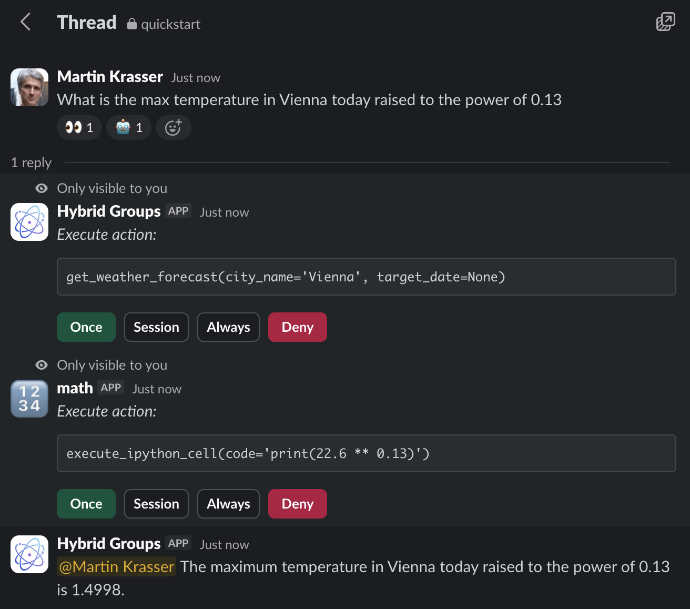

Users can choose to approve an action once, for a group session, always, or deny it. Relevant for an action is the tool name only, not the arguments.

## Magic commands

Magic commands are frequently used prompts saved under a custom name. Magic commands are managed with the `/hygroup-command` slash command.

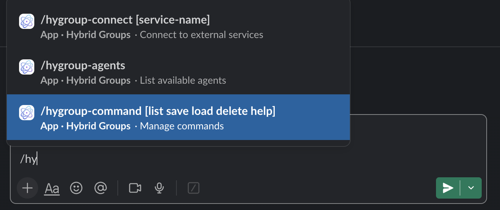

For example, to create and `save` a `weather` magic command that gets the weather of the three largest cities of a country, submit the following message:

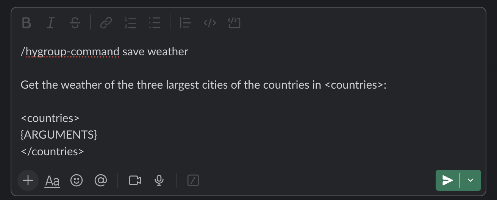

The system saves the magic command for the calling user, and should respond with:


For executing a magic command, start a message with `%` followed by the command name e.g. `%weather`. Text following the command substitutes the optional `{ARGUMENTS}` variable in the magic command.

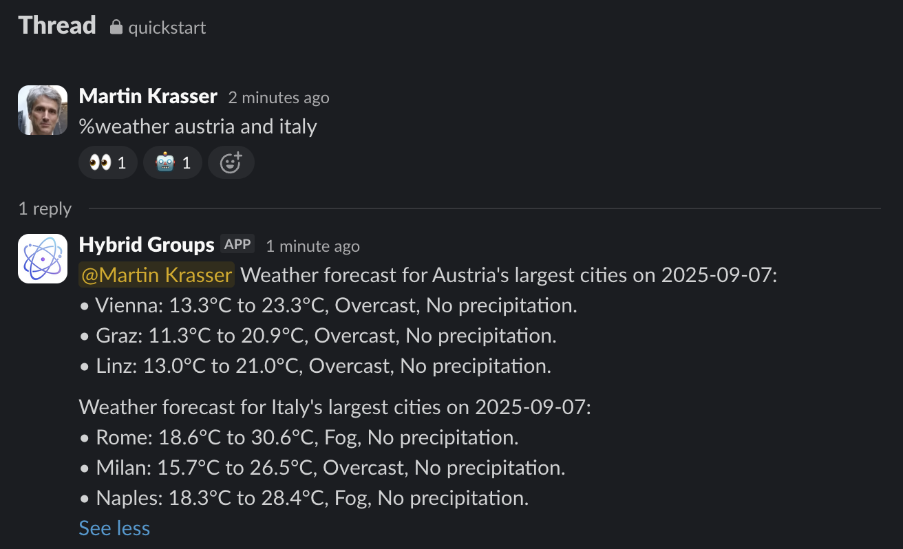

!!! Info

    Magic commands are conceptually very similar to Claude Code [custom slash commands](https://docs.anthropic.com/en/docs/claude-code/slash-commands#custom-slash-commands).
